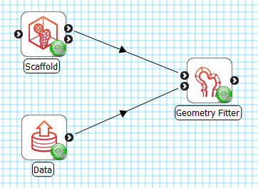
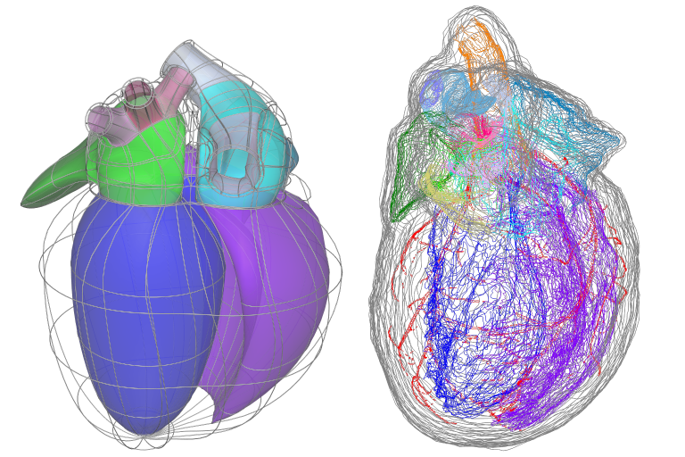
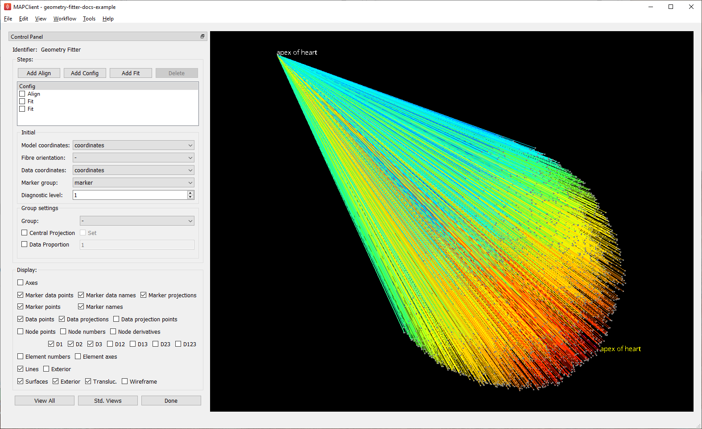
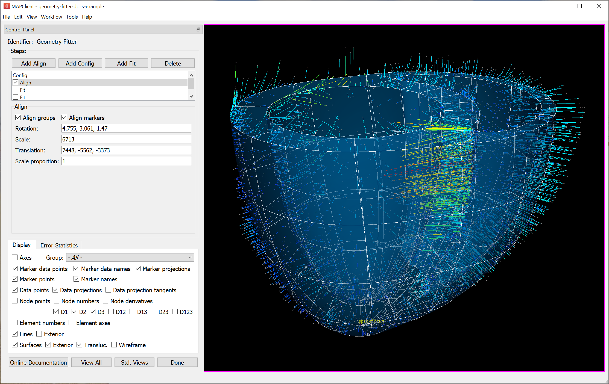
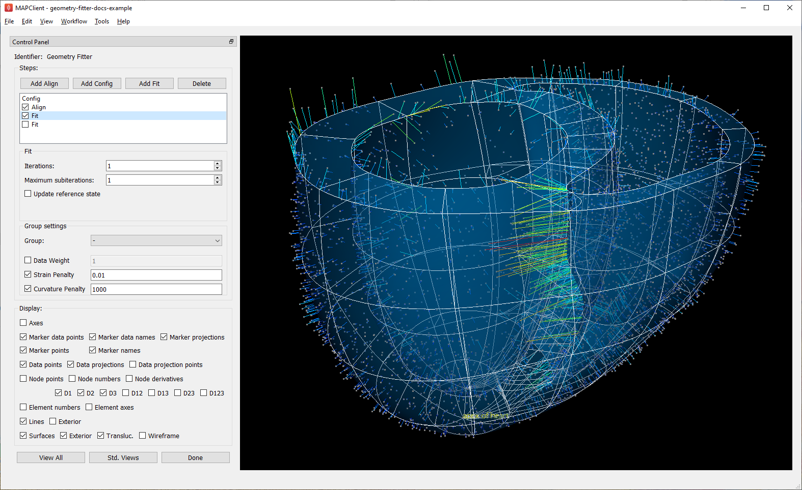
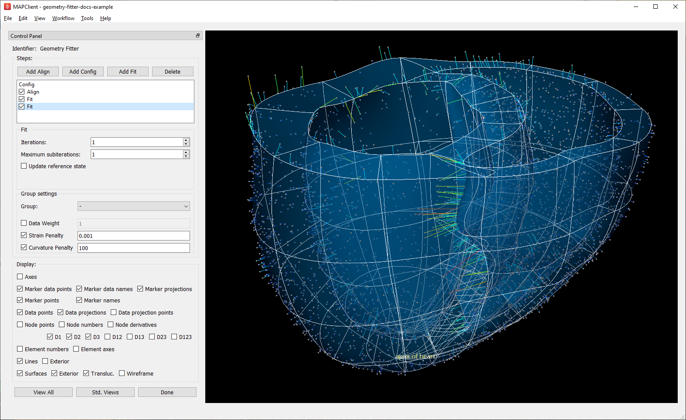

Geometry Fitter
===============

Overview
--------

The **Geometry Fitter** tool fits the geometric coordinates of an Anatomical Scaffold to digitized contours and fiducial marker point data for an individual patient or specimen. The result is a fitted geometric model of that individual which can be used for:

* Embedding other spatial data obtained in the same configuration in standard material coordinates for the scaffold, e.g. positions of nerves, or discrete points with measured physiological field data. See **Data Embedder**;
* Fitting continuous non-geometric fields over the scaffold to discrete measured physiological field data. See **Field Fitter**;
* Building individualized computational models (external tools);
* Contributing to a population-wide geometry study e.g. as data for Principal Component Analysis to determine standard mode shapes of normal or pathological specimens (external tools).

Geometric fitting is a highly non-linear process, for which there is no definitive best answer. Experience is needed, and guidance should be sought if unsure of the validity of your results.

The fit is defined by a sequence of steps which make the scaffold geometry conform increasingly closely to the digitized data. The solution is ‘good enough’ once fitting errors are sufficiently low and the fitted geometry is faithful to what is observed without unrealistic distortion. The attainable closeness of fit is limited by the structure and resolution of the scaffold, and sometimes by the capabilities of the fitting tool itself, but ongoing improvements to these tools can be applied to your mapping workflows as they become available.

The sequence of fitting steps is recorded by the tool in the workflow and can be replayed to fit the same data again. Once the fitting sequence is working well for a single specimen, it can generally be applied to other specimens from the same cohort study. In this way, the mapping workflow becomes the protocol for processing data across the cohort or population.

This document describes how to set up and run the fitting sequence in the **Geometry Fitter** user interface in the Mapping Tools. The fitting sequence and solution process are managed by the underlying *scaffoldfitter library* which can run it without a user interface, together with the *Zinc library* which handles model representation and computation.

Workflow Connections
--------------------

As shown in :numref:`fig-geometry-fitter-workflow`, the **Geometry Fitter** uses 2 inputs on the left, both *Zinc library* compatible EX files:

1. The scaffold to fit, output from **Scaffold Creator**, or **File Chooser** if read from a file (top input);
2. The data to fit to e.g. a converted `MBF XML file <https://neuromorphological-file-specification.readthedocs.io/en/latest/NMF.html>`_ output by the **MBFXML2EX Converter** tool (bottom input).

It produces 1 output, also a Zinc EX file, which may be piped to other workflow steps:

1. The fitted field definition.

The output fitted field takes the name of the field chosen to fit prefixed with "fitted ", so both fields can be loaded simultaneously for later visualization.

.. _fig-geometry-fitter-workflow:

   **Geometry Fitter** workflow connections.
   
Whether you use the output in a further workflow step or not, on completion of the workflow step the output is written to a file in the workflow folder under the same name as the step with extension ".exf".

Background
----------

Some background understanding of fitting is needed in order to effectively define the fitting steps.

The fit is governed by matching annotated groups in the scaffold and data as shown by the matching colours in :numref:`fig-mcpgf-scaffold-data-annotation-groups`. Groups of surfaces or edges in the scaffold are annotated with `standard anatomical names and terms <https://scicrunch.org/sawg/interlex/dashboard>`_. In order to fit the scaffold, data must be similarly annotated, whether converted from annotated contours in an `MBF XML file <https://neuromorphological-file-specification.readthedocs.io/en/latest/NMF.html>`_, or by creation of named data groups by other tools.

.. _fig-mcpgf-scaffold-data-annotation-groups:

   Matching annotation groups by colour in Scaffold (left) and Data (right).

The above data is a `digitized rat heart from Leung et al <https://sparc.science/datasets/77>`_, and as an illustration, the group of dark blue surfaces and data contours are annotated as `"endocardium of left ventricle" / UBERON:0009713 <https://scicrunch.org/sawg/interlex/view/ilx_0728806>`_. Be aware that groups are currently matched by name (ignoring case) in the Mapping Tools, but in future the anatomical term identifiers will be used to match equivalent features where different but synonymous names have been used.

Data groups should only be annotated with terms representing 2-D surfaces or 1-D edges as we can generally only digitize boundaries of features. During fitting, data points in each named group are projected to the nearest point on the same-named 2-D surface or 1-D edge group on the scaffold (see :numref:`fig-fit-step-align` later); if none exists the data for that group is ignored. The fitting process calculates parameters of the scaffold coordinate field which minimize the projection lines between the data and these nearest points. A typical fitting sequence will repeatedly solve and reproject the data points until there is negligible change in the fitted geometry. This non-linear process allows the scaffold to slide across the data cloud to its eventual fitted position.

Single marker points with matching names in the scaffold and data are *fiducial markers* (also known as *landmarks*), which have precisely known anatomical locations specified in material coordinates on the scaffold. These don’t need to be projected. By convention, these are in a group called "marker". Such points are valuable for tying down known locations and are often more highly weighted (see later) to reflect confidence in their locations.

Successful fitting requires good data projections. The projection lines should direct the right parts of the scaffold onto the data in a systematic way. Key to this is:

1. Getting the scaffold sufficiently close to its eventual fitted location in the initial alignment;
2. Maintaining the smooth shape of the scaffold in early fit steps, using deformation penalties.

Poor alignment or loss of smoothness leads to poor data projections, which can make the fit unstable, with unrealistic and unrecoverable distortion.

Fit Steps
---------

To illustrate building a sequence of fit steps we will use a `rat heart ventricles fitting example workflow <https://github.com/mapclient-workflows/geometry-fitter-docs-example>`_ (`download zip <https://github.com/mapclient-workflows/geometry-fitter-docs-example/archive/refs/heads/main.zip>`_) which uses data adapted from `Leung et al <https://sparc.science/datasets/77>`_ by removing the base/valve region and above, relabelling the outer surface of the heart as "epicardium" (which is in reality some distance inside it) and reducing the number points. The first part of the workflow uses **Scaffold Creator** to create scaffold type "3D Heart Ventricles 1" with Parameter set "Unit Rat 1"; click "Done" to move on to fitting.

.. note::

   Fitting is **slow**. Even with this modest-sized example, fit calculations take several seconds to run, and for large problems this can become minutes. For this reason the **Geometry Fitter** interface requires the user to invoke fitting steps, as explained below, and ... patience is needed!

Config
^^^^^^

:numref:`fig-fit-step-config` shows the **Geometry Fitter** user interface just after loading (after waiting for initial data projections to be calculated). The first fit step is always a Config
step, and this is shown in the figure. There is no checkbox on the front of the first Config step because it cannot be disabled. You can add more Config steps by clicking the "Add Config" button.
The Config step will only affect the steps after/below it until there's another Config step.
The initial graphical view is dominated by the projection lines from the data in 1000s of microns back to a unit-size scaffold, with longest to shortest projections coloured by a spectrum from red to blue.

.. _fig-fit-step-config:

   Initial configuration with data projections shown before alignment.

The Steps box in the top-left corner lists the fit steps in the order they will be run. In your own work you'll need to add Align, Config and Fit steps as needed (and use drag & drop to reorder the list), but these are pre-added with appropriate parameters for this example. **Do not check** any of the boxes beside the steps yet, as this invokes the fitting. It's important to understand how these controls work: checking a step runs all uncompleted steps up to the end of that step; unchecking a step reloads and runs all fitting steps up to the end of the step above it. Note one issue with the interface: if you change parameters of an already-completed step you must manually uncheck steps to force it to be re-run. Clicking *Done* saves the settings then runs the remaining unfinished fit steps before moving to the next workflow step.

At any time (apart from when calculations are being performed) you may turn on or off separate graphics in the *Display* tab, or transform the view in the window using mouse button dragging (along with Crtl/Alt on Mac) to rotate, translate and zoom. Of special note is the *Group* which allows a subset of the model to be viewed. In the *Error Statistics* tab you can view the current RMS and maximum projection errors, which the fit aims to minimize. The *View All* button restores a standard perspective view of all the graphics, while the *Std. Views* button cycles standard orthographics views.

The first step is always Config type, with an Initial configuration box in which you must choose options used across all fit steps. Holding the mouse pointer over most of these options shows "tool tips" describing their use. The *Model coordinates* specifies the geometric field to fit, usually ``coordinates``, but for some scaffolds ``flat coordinates`` are available to fit to flat mount specimen data; in either case the output fitted field is that name prefixed with ``fitted``. The optional *Model fit group* allows the fit to be performed over the chosen subgroup of the whole model. The *Fibre orientation* is discussed in :ref:`section-advanced-features`. The optional *Flatten group* constrains the chosen group to z=0 in 3-D, e.g. choosing a surface group allows fitting flat specimens even from 3-D models. The *Data coordinates* and *Marker group* are usually discovered automatically, but can be manually set if needed. Setting a *Diagnostic level* above zero causes diagnostic information to be written to the console as fit steps run, for listings of which annotation groups are matched or not, and fitting objective values to see how the fit reduces projection errors.

The rest of the Config step parameters control what data is projected and how. Adding another Config step later in the sequence allows you to cancel or override any projection settings. Parameters are specified either for a particular named group in the model and data, or if set for special group ``- Default -`` the values are used for any group without specifically set values. The *Data proportion* from 0.0 (none) to 1.0 (all) reduces the data being projected if there is too much to see or it affects performance. The *Central projection* is more specialized: if set (by checking the option AND the *Set* checkbox), the geometric centre of the data and the scaffold group are calculated, and the data is projected as if these are at the same point; this is useful for early fitting steps where small features are not close to the data, but it must always be cancelled later. The Central projection feature has been used to help fit the pink pulmonary vein groups in the rat heart atria in :numref:`fig-mcpgf-scaffold-data-annotation-groups`.

Config parameters for each group are inherited from prior Config steps for that group, and if not set, from the ``- Default -`` group. Previously set group parameters are shown as "half-checked" (using a "tri-state" checkbox), and this can be overridden with a new value (fully checked) or cancelled to prior defaults (unchecked). The value used for that group is always shown.

Align
^^^^^

After initial configuration it's most common to have an Align step which sets rotation, translation and uniform scaling of the scaffold to get it close enough to the data for sensible data projections to be made. :numref:`fig-fit-step-align` shows successful alignment of the ventricles example.

.. _fig-fit-step-align:

   Scaffold after automatic alignment to groups and markers.

It's possible, but difficult, to manually align the scaffold by entering transformation parameters. Interactive alignment with the mouse is not yet implemented.

However, it's preferable to automate alignment so no human intervention is needed, particularly when running the fit sequence for multiple specimens. This requires at least 3 corresponding non-colinear points to be present in the data and scaffold, which may come from 2 sources:

1. Checking *Align markers* includes any fiducial marker points present in both the scaffold in data. In the example, there is a single marker point "apex of heart" which is of high quality for alignment. The label for this marker can be seen at the bottom of the figure, both in the scaffold (white) and data (yellow).
2. Checking *Align groups* includes pseudo marker points at the geometric centre of each named data group, and each corresponding scaffold group. In the example, the "endocardium of left ventricle" and "endocardium of right ventricle" groups clearly make a nice triangle with the apex for alignment; "epicardium" is not so helpful as its centre is close to the centre of the whole scaffold/data.

If either of the above are checked, automatic alignment is performed. This is a non-linear optimization which computes the transformation parameters giving minimal differences between scaffold and data marker/group points. Looking at the above figure we can already see the scaffold is quite a good fit, and the projection lines are relatively parallel meaning they are consistent in how they will pull the scaffold to the data during the fit.

The calculated scale may be a little larger or smaller than wanted for the final fit. Usually it is close enough to fit correctly, but sometimes it is necessary to force a different relative scale. Newer versions of **Geometry Fitter** support a *Scale proportion* parameter which makes the final scale the chosen proportion of the optimal scale, e.g. 0.9 gives 90% scale. Making the model smaller can be helpful when using the *Flatten group* setting.

After the Align step the geometric configuration becomes the "reference state" which later deformations are defined with respect to, and to which penalties may be applied.

Fit
^^^

The Fit step solves a *least-squares* minimization, computing the fit field parameters which minimize the square of the difference between data points and their projections on the scaffold (the "projection error") in each coordinate direction. Perfect agreement between scaffold and data is seldom possible, as there is usually noise or detail in the data that the smooth field representation over the scaffold cannot resolve due to its resolution (number of elements and the interpolation functions used in each). The result is like a "best fit" curve through data -- an optimal average position of the scaffold.

It's usually not possible to fit using just the data projection minimization, because there will be field parameters in the scaffold which are not adequately constrained by data point projections, either in the interior, outside the data, or where data is sparse (where there is less data than the number of field parameters, locally or globally). Attempting to solve in such situations results in some or all of the scaffold appearing to explode, an unrecoverable situation. Furthermore, if data is noisy with random fluctuations in data point positions, the fitted scaffold may end up wavy and not representative of the observed shape, and from that state it is usually not possible to recover to a realistic solution. The solution for both cases is to add additional terms to the fit which scale measures of deformation: small "penalty" values multiplying these terms are usually sufficient to maintain a stable and sensibly shaped solution without excessively affecting the data projection fit. These penalties, particularly those scaling curvature, help maintain the smoothness of the fitted field.

:numref:`fig-fit-step-fit1` shows the end of an initial coarse fit using high deformation penalties to maintain smoothness. It may not look like it has changed much, but the projection lines are significantly shorter over most of the scaffold indicating a closer fit.

.. _fig-fit-step-fit1:

   Scaffold after initial fit with high deformation penalties.

The Fit step has several user controls:

* *Iterations* sets the number of iterations of full solve with the same fit parameters including re-projection of data between iterations;
* *Maximum subiterations* is currently unused;
* *Update reference state*, if checked, updates the reference state to the current geometry at the end of all iterations in the step. This is an advanced feature which should not be used unless fully understood.

The following Fit step parameters can be set for either for individual groups or for the special ``- Default -`` group which applies on any group not specifically set:

* *Data weight* is a non-negative value which multiplies the projection error for each group, with default value 1.0. Setting value 10.0 for one group makes that group conform more closely to the data at the expense of other groups, as if there were 10x as many data points. Note when using the *Flatten group* Config option, this parameter for the chosen group weights the integral over that group which applies the flattening; there should not be data points for the flatten group.
* *Strain penalty* is a scale factor multiplying the components of the Lagrangian large strain tensor relative to the reference state. This penalty tends to keep scaffold linear dimensions near where they were during the fit, and is helpful for maintaining stability in regions outside the data. Very high values pull the scaffold back to its reference state, which is not wanted. The large strain terms are non-linear and handle rotation during the fit, which generally requires several iterations to converge.
* *Curvature penalty* is a scale factor multiplying the gradient of the deformation gradient with respect to reference coordinates. This is often the more useful penalty to use. Higher values reduce curvature in the fitted field relative to the reference coordinates which is essentially what is needed to keep a smooth solution without excessive waviness, so data projections remain sensible.

As for Config, Fit parameters for each group are inherited from prior Fit steps for that group, and if not set, from the special ``- Default -`` group. Previously set group parameters are shown as "half-checked" (using a "tri-state" checkbox), and this can be overridden with a new value (fully checked) or cancelled to prior defaults (unchecked). The value used for that group is always shown.

Deformation penalties are applied on the highest dimension elements making up the scaffold, so for 3-D scaffolds, these can only be applied to 3-D annotation groups in the scaffold, not lower dimensional groups. Setting different deformation penalties for a group makes that region stiffer or more pliable relative to the rest of the scaffold.

In this example the *Data weight* for the ``marker`` group is set to 100.0 (not shown) so the "apex of heart" point is made to conform very closely to the data. As this is the initial fit, we choose a high value of *Curvature penalty* (1000.0) to avoid a wavy solution, plus a small *Strain penalty* (0.01) which helps keep the solution stable. These are applied to the whole scaffold (i.e. the ``- Default -`` group), and together these keep the solution smooth so that data projections are sensible for the second iteration.

Choosing the deformation penalty values takes experience, and some trial-and-error. The required penalty values will vary depending on the units/scale of the data, the number of data points, how solid or hollow the scaffold is, and the values chosen for data proportion and data weights (which effectively scale the number of data points). (At some point these will be "non-dimensionalized" to remove most of the effects of data scale, but this has not yet been done.) For now, you need to do a parameter search to find values that have the desired effect: starting at 1.0, go up or down by 2 orders of magnitude (100x if going up, 0.01x if going down) until the behaviour is close to what you want, then fine tune. Note that for a set of specimens of similar size, similar numbers of data points, and fitting the same scaffold, the same values should work acceptably.

:numref:`fig-fit-step-fit2` shows the scaffold at the end a second fit step using deformation penalties 0.1x as high as for the first fit step.

.. _fig-fit-step-fit2:

   Scaffold after fine fit with lower deformation penalties.

The data projections are small over most of the surfaces, but some regions show larger projection errors. 1-2 more iterations would help pull the top surface up to the data, which is left for the user to try. There are several remaining issues with the fit:

1. The overall shape is quite wavy, but this is in the data itself. It was imaged from an ex-vivo specimen embedded in gel, so some deformation is likely to have occurred in preparing the specimen.
2. The largest projection errors remain on the cusp at the inflow of the quarter-moon-shaped right ventricle, shown near the front of the scaffold. Regions where surfaces come close together are difficult to fit as projections may be made to the wrong surface, but that isn't happening here. An anatomical scaffold is a continuum model of the anatomy, intended to represent the bulk behaviour of the tissue. Particularly in larger animals the surface of the fibrous heart muscle consists of discrete *trabeculae* which lace the surface, permitting blood flow between them. The cusps of the right ventricle are usually criss-crossed with trabeculae, and are therefore neither clearly sharp nor rounded. The best fit for the continuous scaffold in this area is a compromise between the data coordinates in this region which gives an average representation of the tissue. An investigator may choose to digitize less data to control this, or fitting features such as discarding the most distant data points may assist in this region. As it turns out, the fit in this region is probably what was wanted.
3. The middle regions of the cusp at the far end of the right ventricle is not well fitted for the opposite reason: it was initially too far from the data so the more distant parts lacked projections which would pull it back. New features are being considered for this situation, such as allowing group data to be arbitrarily scaled (about its centroid) when performing projection.
4. There are contours crossing the right ventricle which may be papillary muscles. If so they should have been annotated as such, so papillary muscles can be fit once included in the heart scaffold, but until then it's if they aren't annotated as "endocardium of right ventricle".

.. note::

   The developers want to hear about your fitting issues and are open to good ideas for improving it.

.. _section-advanced-features:

Advanced Features
-----------------

The **Geometry Fitter** has some features which may help fitting in certain cases:

1. Deformation penalties can be multi-component to give different penalties (to be more/less stiff) in different directions. If fewer values than the number expected are entered, the last value is used for all remaining factors (which is how a single value works), so you'll usually need to set either one or all values:
    * Up to 9 values can be set for *Strain penalty* in 3-D problems (4 in purely 2-D problems). The first 3 values give the penalties for the first component of the fitted field with respect to the components of the reference coordinates, the second 3 values are for the second component, while the last 3 values are for the third component.
    * Up to 27 values can be set for the *Curvature penalty* in 3-D problems, 9 for the first component, followed by 9 for each of the second and third components. These scale 9 second derivatives which are indexed by the reference coordinate components twice. This is a symmetric matrix and the penalties for each component are also expected to be symmetric with only 6 independent values, e.g. [A B C B D E C E F], where A, D and F are penalty values for curvature in the 1-1, 2-2 and 3-3 directions, while B, C and E are penalty values for shear in the 1-2, 1-3 and 2-3 directions.
2. If a *Fibre orientation* field is specified in the initial Config step, the deformation gradients (to penalise) are measured with respect to local fibre axes in each element. At this time only the in-built "zero fibres" field is practical for use (otherwise choose "-" to disable). This reorients the reference coordinates to a local coordinate system where the first direction is in line with the local element axis 1 (show "Element axes" graphics to see), the second direction is normal to this in the 1-2 plane of the element axes, and the third direction is normal to both of these. Uses include:
    * For scaffolds where the third element axis is through the wall of a hollow structure, multi-component deformation penalties can be applied separately in-plane (reference components 1 and 2) and through the wall (reference component 3). This can be used to make a group stiffer in-plane, but more pliable through the wall. Likewise, increasing penalties on shear deformation in the 1-3 and 2-3 directions will reduce these out-of-plane shear deformations during fitting.
    * When fitting 3-component coordinate fields on a 2-D surface scaffold, a fibre orientation field must be set in order to use deformation penalties. This is because the gradients must be transformed to be with respect to in-plane directions.
